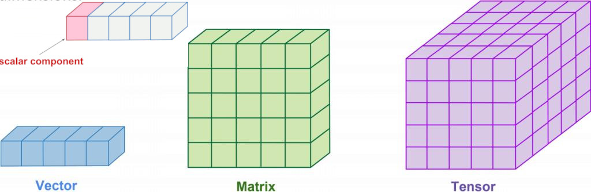
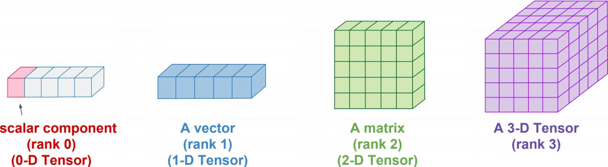
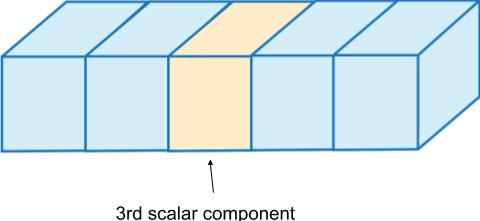
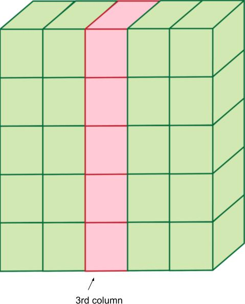
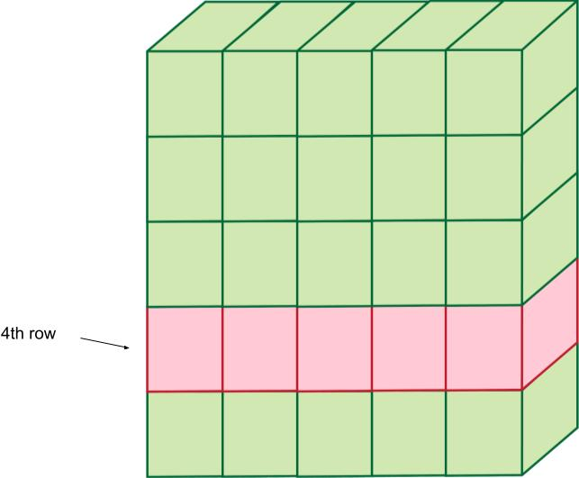
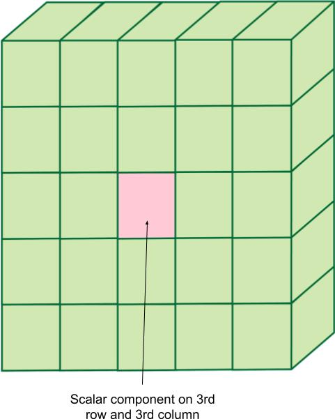

Intro to Tensors
================

- Whats Scalar?.
- Whats Vector?.
- Whats Matrix?.
- Whats Tensor?.

-----

- Whats Rank?.
- Whats Dimension?.

-----

Code
====

- Whats Scalar, Vector, Matrix, Tensor on Code?.

Scalar:

.. code-block:: nim

  let myscalar = 42

Vector:

.. code-block:: nim

  let myvector = [1, 2, 3]

Matrix:

.. code-block:: nim

  let mymatrix = [
                   [1, 2, 3],
                   [4, 5, 6],
                 ]

Tensor:

.. code-block:: nim

  let mytensor = [
                   [
                     [1, 2, 3],
                     [4, 5, 6],
                   ],
                   [
                     [7,   8,  9],
                     [10, 11, 12],
                   ],
                 ]

-----

Slicing
=======

- Read, write, play with the Tensor.

.. code-block:: nim

  import arraymancer

  var mytensor = [
      [1, 2, 3, 4, 5] # 0
      #0  1  2  3  4
    ].toTensor

  echo mytensor[0, 2]  # Read
  mytensor[0, 2] = 42  # Write

.. code-block:: nim

  import arraymancer

  var mytensor = [
      [1,   2,  3,  4,  5],  # 0
      [6,   7,  8,  9, 10],  # 1
      [11, 12, 13, 14, 15],  # 2
      [16, 17, 18, 19, 20],  # 3
      [21, 22, 23, 24, 25],  # 4
      # 0   1   2   3   4
    ].toTensor

  echo mytensor[_, 2]

.. code-block:: nim

  import arraymancer

  var mytensor = [
      [1,   2,  3,  4,  5],  # 0
      [6,   7,  8,  9, 10],  # 1
      [11, 12, 13, 14, 15],  # 2
      [16, 17, 18, 19, 20],  # 3
      [21, 22, 23, 24, 25],  # 4
      # 0   1   2   3   4
    ].toTensor

  echo mytensor[3, _]

.. code-block:: nim

  iimport arraymancer

  var mytensor = [
      [1,   2,  3,  4,  5],  # 0
      [6,   7,  8,  9, 10],  # 1
      [11, 12, 13, 14, 15],  # 2
      [16, 17, 18, 19, 20],  # 3
      [21, 22, 23, 24, 25],  # 4
      # 0   1   2   3   4
    ].toTensor

  echo mytensor[2, 2]
