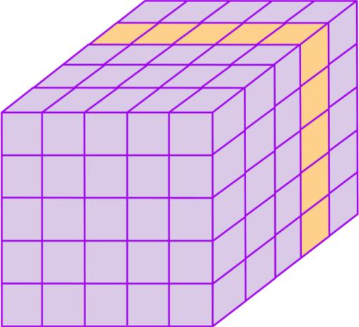
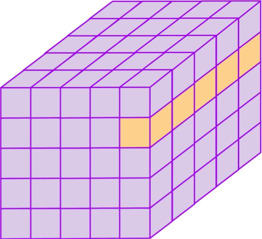
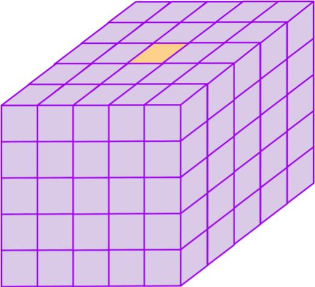

Intro to Tensors
================

- Whats Scalar?.
- Whats Vector?.
- Whats Matrix?.
- Whats Tensor?.

.. image:: tensor0.jpg

-----

- Whats Rank?.
- Whats Dimension?.

.. image:: tensor1.jpg

-----

Code
====

- Whats Scalar, Vector, Matrix, Tensor on Code?.

Scalar:

.. code-block:: nim

  let myscalar = 42

Vector:

.. code-block:: nim

  let myvector = [1, 2, 3]

Matrix:

.. code-block:: nim

  let mymatrix = [
                   [1, 2, 3],
                   [4, 5, 6],
                 ]

Tensor:

.. code-block:: nim

  let mytensor = [
                   [
                     [1, 2, 3],
                     [4, 5, 6],
                   ],
                   [
                     [7,   8,  9],
                     [10, 11, 12],
                   ],
                 ]

-----

Slicing
=======

- Read, write, play with the Tensor.

.. image:: tensor2.jpg

.. code-block:: nim

  import arraymancer

  var mytensor = [
      [1, 2, 3, 4, 5] # 0
      #0  1  2  3  4
    ].toTensor

  echo mytensor[0, 2]  # Read
  mytensor[0, 2] = 42  # Write

----

.. image:: tensor3.jpg

.. code-block:: nim

  import arraymancer

  var mytensor = [
      [1,   2,  3,  4,  5],  # 0
      [6,   7,  8,  9, 10],  # 1
      [11, 12, 13, 14, 15],  # 2
      [16, 17, 18, 19, 20],  # 3
      [21, 22, 23, 24, 25],  # 4
      # 0   1   2   3   4
    ].toTensor

  echo mytensor[_, 2]

----

.. image:: tensor4.jpg

.. code-block:: nim

  import arraymancer

  var mytensor = [
      [1,   2,  3,  4,  5],  # 0
      [6,   7,  8,  9, 10],  # 1
      [11, 12, 13, 14, 15],  # 2
      [16, 17, 18, 19, 20],  # 3
      [21, 22, 23, 24, 25],  # 4
      # 0   1   2   3   4
    ].toTensor

  echo mytensor[3, _]

----

.. image:: tensor5.jpg

.. code-block:: nim

  import arraymancer

  var mytensor = [
      [1,   2,  3,  4,  5],  # 0
      [6,   7,  8,  9, 10],  # 1
      [11, 12, 13, 14, 15],  # 2
      [16, 17, 18, 19, 20],  # 3
      [21, 22, 23, 24, 25],  # 4
      # 0   1   2   3   4
    ].toTensor

  echo mytensor[2, 2]

----

.. code-block:: nim

  import arraymancer

  var mytensor = [
      [
        [ 1,  2,  3,  4,  5],      # 1st Matrix.
        [ 6,  7,  8,  9, 10],
        [11, 12, 13, 14, 15],
        [16, 17, 18, 19, 20],
        [21, 22, 23, 24, 25],
      ],
      [
        [26, 27, 28, 29, 30],      # 2nd Matrix.
        [31, 32, 33, 34, 35],
        [36, 37, 38, 39, 40],
        [41, 42, 43, 44, 45],
        [46, 47, 48, 49, 50],
      ],
      [
        [51, 52, 53, 54, 55],      # 3rd Matrix.
        [56, 57, 58, 59, 60],
        [61, 62, 63, 64, 65],
        [66, 67, 68, 69, 70],
        [71, 72, 73, 74, 75],
      ],
      [
        [76, 77, 78, 79,  80],     # 4th Matrix.
        [81, 82, 83, 84,  85],
        [86, 87, 88, 89,  90],
        [91, 92, 93, 94,  95],
        [96, 97, 98, 99, 100],
      ],
      [
        [101, 102, 103, 104, 105], # 5th Matrix.
        [106, 107, 108, 109, 110],
        [111, 112, 113, 114, 115],
        [116, 117, 118, 119, 120],
        [121, 122, 123, 124, 125],
      ]
    ].toTensor

  echo mytensor[3, _, _]

----

.. code-block:: nim

  import arraymancer

  var mytensor = [
      [
        [ 1,  2,  3,  4,  5],      # 1st Matrix.
        [ 6,  7,  8,  9, 10],
        [11, 12, 13, 14, 15],
        [16, 17, 18, 19, 20],
        [21, 22, 23, 24, 25],
      ],
      [
        [26, 27, 28, 29, 30],      # 2nd Matrix.
        [31, 32, 33, 34, 35],
        [36, 37, 38, 39, 40],
        [41, 42, 43, 44, 45],
        [46, 47, 48, 49, 50],
      ],
      [
        [51, 52, 53, 54, 55],      # 3rd Matrix.
        [56, 57, 58, 59, 60],
        [61, 62, 63, 64, 65],
        [66, 67, 68, 69, 70],
        [71, 72, 73, 74, 75],
      ],
      [
        [76, 77, 78, 79,  80],     # 4th Matrix.
        [81, 82, 83, 84,  85],
        [86, 87, 88, 89,  90],
        [91, 92, 93, 94,  95],
        [96, 97, 98, 99, 100],
      ],
      [
        [101, 102, 103, 104, 105], # 5th Matrix.
        [106, 107, 108, 109, 110],
        [111, 112, 113, 114, 115],
        [116, 117, 118, 119, 120],
        [121, 122, 123, 124, 125],
      ]
    ].toTensor

  echo mytensor[_, 1, 4]

----

.. code-block:: nim

  import arraymancer

  var mytensor = [
      [
        [ 1,  2,  3,  4,  5],      # 1st Matrix.
        [ 6,  7,  8,  9, 10],
        [11, 12, 13, 14, 15],
        [16, 17, 18, 19, 20],
        [21, 22, 23, 24, 25],
      ],
      [
        [26, 27, 28, 29, 30],      # 2nd Matrix.
        [31, 32, 33, 34, 35],
        [36, 37, 38, 39, 40],
        [41, 42, 43, 44, 45],
        [46, 47, 48, 49, 50],
      ],
      [
        [51, 52, 53, 54, 55],      # 3rd Matrix.
        [56, 57, 58, 59, 60],
        [61, 62, 63, 64, 65],
        [66, 67, 68, 69, 70],
        [71, 72, 73, 74, 75],
      ],
      [
        [76, 77, 78, 79,  80],     # 4th Matrix.
        [81, 82, 83, 84,  85],
        [86, 87, 88, 89,  90],
        [91, 92, 93, 94,  95],
        [96, 97, 98, 99, 100],
      ],
      [
        [101, 102, 103, 104, 105], # 5th Matrix.
        [106, 107, 108, 109, 110],
        [111, 112, 113, 114, 115],
        [116, 117, 118, 119, 120],
        [121, 122, 123, 124, 125],
      ]
    ].toTensor

  echo mytensor[2, 0, 2]
