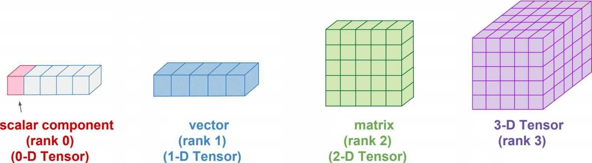

Intro to Tensors
================

- Whats Scalar?.
- Whats Vector?.
- Whats Matrix?.
- Whats Tensor?.

.. image:: tensor0.jpg

-----

- Whats Rank?.
- Whats Dimension?.

-----

Code
====

- Whats Scalar, Vector, Matrix, Tensor on Code?.

Scalar:

``let myscalar = 42``

Vector:

``let myvector = [1, 2, 3]``

Matrix:

``let mymatrix = [ [1, 2, 3], [4, 5, 6] ]``

.. code-block:: nim

  let mymatrix = [
                   [1, 2, 3],
                   [4, 5, 6],
                 ]
