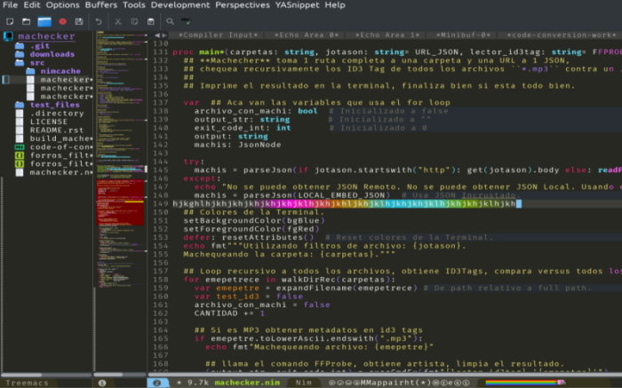

# Intro to Nim


*...for Python devs*

-----


* Python-like Syntax and C-like performance.
* Compiled (Static Binary executable).
* Strong static Typing with Inference.
* Compiles to C / C++.
* Compiles to JavaScript (DOM API).
* Linux, Windows, Mac, Web, etc.
* Easy to make Python modules.
* Easy to use C libs.

-----

### Hello World!

```bash
$ mkdir /tmp/sample ; cd /tmp/sample/

$ echo 'echo "Hello World"' > hello.nim

$ nim c -r hello.nim          # C
Hello World

$ nim cpp -r hello.nim        # C++
Hello World

$ nim c --cpu:amd64 --os:windows hello.nim
$ wine hello.exe              # Windows
Hello World

$ nim js -d:nodejs hello.nim  # NodeJS
$ nodejs hello.js
Hello World

$ nim js hello.nim            # Web (Frontend)

$ lsb_release -d
Description:  Arch Linux
```

[<sub>Code of all the slides on Repo</sub>](ejemplos/)

-----

### Interactive Interpreter


- `nimble install inim`

-----

### Connect C

C:

```c
int sum2Integers(int a, int b) {return a + b;}
```

Nim:

```nim
{.compile: "sum.c".}
proc sum2Integers(a, b: cint): cint {.importc.}
echo sum2Integers(1, 2)
```

```bash
$ nim c -r example.nim
3
```

[<sub>Code on Repo</sub>](ejemplos/ejemplo.nim)

-----

##### Connect Web

<sub>JavaScript &dzigrarr; Nim</sub>

```html
<!-- index.html --->
<script>function sum2Integers(a, b) {return alert(a + b)}</script>
<script src="examplejs2nim.js"></script>
```

```nim
# examplejs2nim.nim
proc sum2Integers(a, b: cint): cint {.importc.}
echo sum2Integers(1, 2)
```

```bash
$ nim js -o:examplejs2nim.js examplejs2nim.nim
$ xdg-open index.html
```

<sub>Nim &dzigrarr; JavaScript</sub>

```html
<!-- index2.html --->
<script src="examplenim2js.js"></script>
<script>alert(sum2Integers(1, 2))</script>
```

```nim
# examplenim2js.nim
proc sum2Integers(a, b: cint): cint {.exportc.} = a + b
```

```bash
$ nim js -o:examplenim2js.js examplenim2js.nim
$ xdg-open index2.html
```

-----

##### Connect Python

Nim:

```nim
import nimpy
proc function*(name: string): string {.exportpy.} = "Hello " & name
```

Python:

```nim
import nim2python
print(nim2python.function("World"))
```

Install Python-Nim bridge:

- `nimble install nimpy`.

Compile:

`nim c --app:lib --out:module.so code.nim`

-----

##### Syntax

- Code blocks by Indentation, no Tabs, no Brackets, no Semicolon.
- Comments start with `#`, DocStrings with `##`.
- Python-like Tracebacks with the line and type of the error.
- Syntax sugar magics, kinda Python Jupiter Notebook.
- Templates and Macros.
- Function Overload, depending the argument type.
- Export objects with `*`, `thing` is private, `thing*` is exported.
- `import module` imports everything that has a `*` on `module.nim`.
- [Some Python modules were copied to Nim.](https://nimble.directory/search?query=python)

-----

##### Tools

- `nim check`, `nimble check` and `nim pretty`.
- Documentation generator `nim doc`.
- Packages and hosted Docs https://nimble.directory
- Nim is written on Nim, easy to hack.
- New project template `nimble init`.
- Task Runner `nimble tasks` *(kinda Grunt)*.
- Publish package `nimble publish` *(GitHub PR)*.
- NimSuggest autocomplete for IDE.
- NimInst installer generator (InnoSetup, Bash).
- NimGrep Grep optimized for Nim (CamelCase vs snake_case).
- Garbage Collector, Customizable or Disabled.

-----

##### PyLib

- Mimics the Python syntax on Nim.
- `nimble install pylib`, then `import pylib`.

```python
>>> import pylib
>>> for i in range(10):   # Mimic Pythons range()
      print(i, endl=" ")  # Mimic Pythons print()
0 1 2 3 4 5 6 7 8 9
>>> print(json_loads("""{"key": "value"}""")  #  Mimic Pythons json.loads(str)
{"key": "value"}
>>> print(sys.platform)              #  Mimic Pythons sys.*
"linux"
>>> print(platform.processor)        #  Mimic Pythons platform.*
"amd64"
>>> print(int('9'))    # integer from char.
>>> print("" or "b")   #  Mimic Pythons str or str
"b"
>>> print("a" or "b")
"a"
>>> timeit(100):  # Mimic Pythons timeit.timeit("code_to_benchmark", number=int)
      sleep(9)    # Repeats this code 100 times. Output is very informative.
2018-05-09T02:01:33 TimeIt: 100 Repetitions on 920 milliseconds, and 9 microseconds, CPU Time 0.00128.
>>> with_open("archive.txt", 'r'):  # Mimics Pythons with open(file, mode='r') as file:
      while not end_of_file(file):  # File is automatically assigned to file variable.
        print(file.read_line())     # No need for " as file", just path and mode.
                                    # File is closed automatically.
```

-----

##### Immutable

- `var` Mutable.
- `let` Immutable.
- `const` Immutable, compilation time.

```nim
>>> var foo = "This variable can change"
>>> foo = "Other stuff"
>>>
>>> let bar = "This variable can not change"
>>> bar = "Gives Error"
Error: 'bar' cannot be assigned to
>>>
>>> const baz = "Compilation Constant"
>>> baz = "Gives Error"
Error: 'baz' cannot be assigned to
```

-----

##### Execution at Compile Time

- `const constant = "compile time"` Constant at compile time.
- `include("inclu.nim")` Copies the whole file in-place.
- `static_read("foo.json")` Reads the whole file and return a string.
- `static_exec("1 + 1")` Executes arguments and return results.
- `static: echo("compile time")` Execute code blocks at compile time.

-----

##### Basic Types

Nim         | Python  | Sample Nim    | Sample Python   | Comments                                  |
------------|:--------|:-------------:|:---------------:|------------------------------------------:|
 `string`   | `str`   | `"foo"`       | `"foo"`         | Unicode, UTF8, Emoji, etc                 |
 `string`   | `str`   | `"""bar"""`   | `"""bar"""`     | String Multi-line                         |
 `char`     | -       | `'a'`         | -               | 1 char, Optimized internally to int       |
 `int`      | `int`   | `42`          | `42`            | int8, int16, int32, int64, int            |
 `float`    | `float` | `2.0`         | `2.0`           | float32, float64, float                   |
 `bool`     | `bool`  | `true, false` | `True, False`   | true, false on Nim                        |
 `tuple`    | `tuple` | `(1, 2, 3)`   | `(1, 2, 3)`     | tuple on Nim is like a NamedTuple on Py   |
 `seq`      | `list`  | `@[1, 2, 3]`  | `[1, 2, 3]`     | Same Type on all items on Nim             |
 `set`      | `set`   | `{1, 2, 3}`   | `{1, 2, 3}`     | int, char, bool on Nim                    |
 `enum`     | `enum`  | ?             | ?               | On Python nobody uses it                  |
 `array`    | -       | `[1, 2, 3]`   | -               | Fixed size, same type on all items        |
 `subrange` | -       | `range[0..2]` | -               | Only accept int from 0 to 2,can use float |

-----

##### Details

- Python `def` its Nim `proc`.
- Python `lambda` its Nim `proc` (withoput name).
- Python `f"{foo},{1+1}"` its Nim `fmt"{foo},{1+1}"`.
- Python `dict` its Nim `table` or `OrderedTable`.
- Python `NamedTuple` its Nim `tuple`.
- Python `set` its Nim `HashSet` or `OrderedSet`.
- Python Ternary Operator its Nim `if..else` inline.
- Python List Comprehension on `sugar` module.
- Nim string its `""`, no `''` (its `char`).
- JavaScript Arrow Functions o `sugar` module.

-----

##### Nim Unified Functions Call Syntax

```nim
>>> let foo = [1, 2, 3]

>>> foo.len
3

>>> foo.len()
3

>>> len(foo)
3

>>> $foo.len
"3"

>>> foo.len.int8
3 : int8
```

-----

##### Nim Case Insensitive


- camelCase & snake_case use it your way.

```nim
>>> let camelCase = 42
>>> camel_case
42

>>> let snake_case = 1
>>> snakeCase
1
```

-----

##### Speed

- Nim was designed to be fast.

Example, same RayTracer implemented on multiple languages:


[<sub>Source</sub>](http://blog.johnnovak.net/2017/04/22/nim-performance-tuning-for-the-uninitiated/#does-it-all-matter)

-----

##### Weight

```bash
$ echo 'echo "Hello World"' > hello.nim
$ nim c -d:release --app:console --opt:size hello.nim
$ strip --strip-all hello
$ upx --best --ultra-brute hello
$ du -h hello
15K     hello
```

- Nim was designed to be lightweight. (Raspi, Router, IoT, etc).
- Nim does not embed VM, Interpreter, etc.
- [HelloWorld Go 2Mb, HelloWorld Nim 20Kb.](http://linkode.org/#narWOQnU9i2UDswu9NDYo1)


-----

##### NimScript

- Interpreted Language *(Limited Nim, no std lib)*.
- Available modules: strutils, ospaths, math, distros.
- Can be used for configuration.
- Can be used for build (build tool).
- Can be used with Nimble.
- Can be used for multi-purpose (standalone).
- File extension `*.nims`.
- Does not compile, use `nim e archivo.nims`.

**Hello World NimScript:**

```nim
#!/usr/bin/env nim
echo "Hello World"
```

-----

##### Unittests

- Friendly Tests Runner.
- `nim c -r test "Nombre del test"`.

```nim
suite "Test Name":

  echo "Setup: Run once before all tests."

  setup:
    echo "Setup: Run once before each test."

  teardown:
    echo "Teardown: Run once after each test."

  test "example":
    assert true

  test "other example":
    check(1 != 1)

  test "example with expected error":
    let foo = [1, 2, 3]
    expect(IndexError):
      echo foo[9]

  echo "Teardown: Run once after all tests."

```

-----

##### Documentation Generator

*Input Format:*
- Nim source code `*.nim`

*Output Formats:*
- HTML5 (TOC, Search, links, index, etc).
- reStructuredText.
- JSON.
- LaTeX.

*Use:*
- Comments starting with `##` parsed as RST or text.

-----

##### CrossCompile

Basically it needs the path to the Compiler.

```bash
$ mkdir /tmp/test_nim_crosscompile ; cd /tmp/test_nim_crosscompile/

$ echo 'echo "Hello World"' > hello.nim

$ nim c --cpu:amd64 --os:windows --gcc.exe:x86_64-w64-mingw32-gcc \
        --gcc.linkerexe:x86_64-w64-mingw32-gcc hello.nim

$ wine hello.exe
Hello World
```

Crosscompile libs are on `mingw-w64-gcc` (Arch).

*Depends on how friendly your Distro is towards crosscompile libs.*

-----

##### Templates

```nim
template templat(argument0, argument1: string, contents: untyped): untyped =

  echo 1 + 2  # Simulate logic inside the template.

  echo argument0
  echo argument1

  # Variables and names inside template are local-only by default.
  var variable_inject {.inject.} = "Kittens" # Not local-only.
  var variable_local = "Puppies"             # local-only.

  contents


templat("1st argument", "2nd argument"):

  echo variable_inject
  # Error: undeclared identifier: 'variable_local'.
  # echo variable_local

  echo "This is the content."
```

-----

##### Macros

```nim
import macros

macro repeat_echo(): untyped =
  result = newNimNode(nnkStmtList)          # Generate empty result.

  var mi_bucle_for = newNimNode(nnkForStmt) # Generate empty for.
  mi_bucle_for.add(ident("indx"))         # Use variable indx on for.

  var rango_para_iterar = newNimNode(nnkInfix).add(
    ident("..")).add(newIntLitNode(0), newIntLitNode(9))  # Generate 0..9.

  var mi_echo = newCall(ident("echo"), newIntLitNode(42)) # Generate echo 42.

  mi_bucle_for.add(rango_para_iterar) # Put range on for loop.
  mi_bucle_for.add(mi_echo)           # Body of for loop.

  result.add(mi_bucle_for)            # Put for loop on result.


repeat_echo()   # Repeat 42, times 10.

expandMacros:    # Generate and view Macro code.
  repeat_echo() # for indx in 0 .. 9: echo(42)
```

-----

##### Template Engine

- Template Engine (ala Jinja).
- File `*.tmpl`, shebang y Nim syntax.
- Lines with `#` are Nim code, else literal.

```nim
#? stdtmpl(subsChar = '$', metaChar = '#')
#proc generateXML(name, age: string): string =
#  result = ""
<xml>
  <name>$name</name>
  <age>$age</age>
</xml>
```

```nim
#? stdtmpl | standard
#proc generateHTML(title, content: string, tabs: openArray[string]): string =
#  result = ""
<head><title> $title </title></head>
<body>
    <ul>
  #for tab in items(tabs):
    <li><a href="${tab}.html">$tab</a></li>
  #end for
    </ul>
    $content
    A dollar: $$.
</body>
```

-----

##### Nim Frontend

- Nim compiles to JavaScript.
- Nim has API of the DOM.
- JavaScript is "First Class Citizen".
- Nim can wrap JS Libs.

Examples:
- Frontend SPA (React-like) https://github.com/pragmagic/karax
- Nim Forum is written on Nim https://forum.nim-lang.org

-----

*Interesting packages, Terminal:*
- Colors https://github.com/molnarmark/colorize
- Spinners https://github.com/molnarmark/spinny
- ProgressBar https://github.com/euantorano/progress.nim
- Graphics https://github.com/FedericoCeratto/nim-dashing
- Configs https://github.com/euantorano/dotenv.nim

*Interesting packages, Web:*
- Web Creator https://github.com/ThomasTJdev/nim_websitecreator
- Web Framework https://github.com/dom96/jester
- Markdown to HTML https://github.com/h3rald/hastyscribe
- Scrapper https://github.com/OpenSystemsLab/q.nim
- Jupyter Kernel https://github.com/stisa/jupyter-nim-kernel
- Plotly https://github.com/brentp/nim-plotly
- Design https://github.com/juancarlospaco/nim-random-font-color

-----

##### Extras

- Homepage https://nim-lang.org
- Nim from Browser https://play.nim-lang.org
- DevDocs http://devdocs.io/nim
- StackOverflow https://stackoverflow.com/questions/tagged/nim
- Rosetta http://rosettacode.org/wiki/Category:Nim
- Tutorial https://nim-lang.org/docs/tut1.html
- Syntax Python https://github.com/Yardanico/nimpylib
- GUI super easy https://github.com/juancarlospaco/nim-kdialog
- Awesome Nim https://github.com/VPashkov/awesome-nim
- Nim Online Community EN https://t.me/nim_lang

-----

##### Install

- [ChooseNim](https://github.com/dom96/choosenim#choosenim)
- Windows, [1 ZIP.](https://nim-lang.org/install_windows.html)
- [Docker](https://hub.docker.com/r/nimlang/nim/), image `nimlang/nim`.
- Linux, Distro package or ChooseNim.
- Manual, source code on any OS.

-----

##### Editor / IDE



[Vim](https://github.com/zah/nim.vim/),
[Emacs](https://github.com/nim-lang/nim-mode),
[Atom](https://github.com/russpowers/nim-atom),
[Sublime](https://github.com/Varriount/NimLime),
[Kate](https://github.com/juancarlospaco/NimKate#screenshots),
[Gedit](https://github.com/nim-lang/Aporia/blob/master/share/gtksourceview-2.0/language-specs/nim.lang),
[Geany](https://github.com/geany/geany/pull/193),
[KDevelop](https://github.com/xyz32/KDevelop-template),
[VS Code](https://marketplace.visualstudio.com/items?itemName=kosz78.nim),
[Spacemacs](https://github.com/juancarlospaco/spacemacs-nim-python#spacemacs-nim-python),
[NeoVim](https://github.com/baabelfish/nvim-nim),
[Notepad++](https://github.com/jangko/nppnim/releases),
[LightTable](https://github.com/zah/nim.lt/),
[Aporia](https://github.com/nim-lang/Aporia),
[etc etc...](https://github.com/nim-lang/Nim/wiki/editor-support)

-----

### Nim needs more Community


*Nim has very interesting features; Lets get this hype started !*

-----

##### Thanks! &hearts;


*Juan Carlos*

- [<sub>github.com/juancarlospaco</sub>](https://github.com/juancarlospaco) [<sub>twitter.com/juancarlospaco</sub>](https://twitter.com/juancarlospaco) [<sub>t.me/juancarlospaco</sub>](https://t.me/juancarlospaco)
- [<sub>Presentation GitHub Repo.</sub>](https://github.com/juancarlospaco/nim-presentation-slides#nim-presentation-slides)
- [<sub><i>Presentation written on Markdown with Microraptor.</i></sub>](https://github.com/juancarlospaco/microraptor#microraptor)
