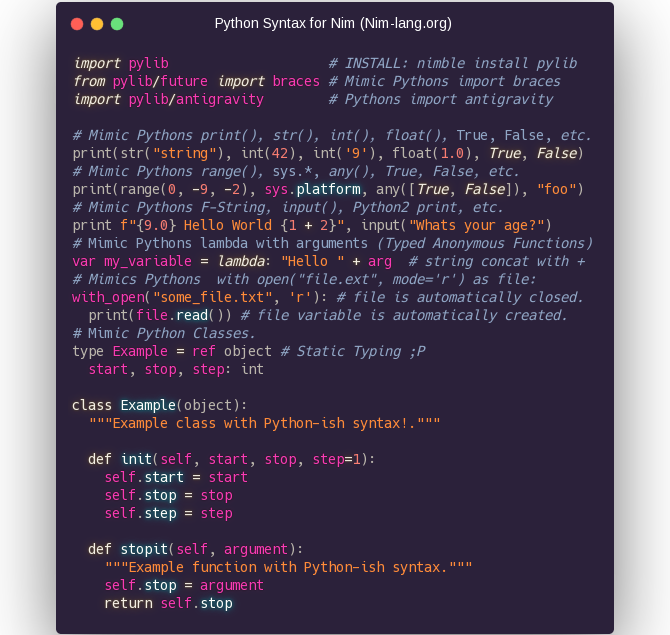

# Intro a Nim

*...para Pythoneras*

-----

* Python Syntax y rendimiento de C.
* Compilado (1 archivo binario ejecutable).
* Tipado estatico fuerte con Inferencia.
* Compila C/C++/ObjC/JavaScript/NodeJS (DOM API).
* Linux, Windows, Mac, Web, Raspi, ARM, IoT, etc.
* Facil hacer modulos Python. Facil usar librerias C.
* Administrador de Paquetes, 1500+ Paquetes.
* Documentacion online completa con ejemplos.
* Targets comunidad LLVM,Vulkan,WebGL,OpenGL,etc.

-----

##### echo "Hola Mundo"

[Codigo de todos los slides esta en el Repo](ejemplos/hello.nim)

-----

### Las APIs mas bonitas que vas a ver

- Compile-Time Postgres/SQLite ORM (Raw-Query Performance).
- `UNION`, `JOIN`, `INTERSECT`, `CASE`, SQL Prepared, and more.

-----

#### Las APIs mas bonitas que vas a ver

- Async MultiThread Web Framework Jester.

-----

#### Las APIs mas bonitas que vas a ver

Frontend Client-Side Reactive VirtualDOM SPA Framework Karax.

-----

##### Para que sirve?

* Frontend funciona similar a Svelte. Python simil Cython. Backend onda Rust.
* Databases (Postgres y SQLite en std lib, Compile-Time ORM, Mongo).
* Machine Learning, AI, HPC, Tensors (PyTorch, Arraymancer, Laser).
* FullStack web frameworks (NimWC, Karax, Jester, HTTPBeast).
* Desktop GUI (GTK3, Qt5 QML, OpenGL, WebView JS, WxWidget).
* Translation (Nimterlingua). Design (compila Figma a App con Fidget).

##### Que ventajas tiene?

* Todo tu Stack con 1 lenguaje, Backend+Frontend, Assembly a WebAssembly.
* Interoperabilidad con C/JS. Deploy simple (`scp`). CompileTime FFI. HCR.
* Usualmente lleva menos lineas de codigo que Python.
* Mas rapido de aprender comparado con Rust o C++.
* Binarios mas chicos que Rust y Go. Compilacion rapida.
* Programacion Inmutable, Funcional y OOP al mismo tiempo.
* AutoDocumentador y AutoFormateador de Codigo integrados.

-----

##### Python usando Nim

- Libreria cliente HTTPS con web scraper multi-threading.

-----

##### Sintaxis Python para Nim

https://github.com/Yardanico/nimpylib

-----

##### Nimporter: Importar Nim en Python

Compila extensiones Nim para Python al importarlas automaticamente!.
Simplemente importas codigo Nim como si fuera codigo Python.

- https://github.com/Pebaz/nimporter

-----

##### Herramientas

- `nim check`, `nimble check` ➡️ Linters
- `nim doc`, `nim rst2html`, `nim rst2tex` ➡️ Documentacion
- `nimble init` ➡️ Template de projecto
- `nimble tasks` ➡️ Task Runner
- `nimble publish` ➡️ Publicar paquetes
- `nimpretty` ➡️ AutoFormateador de codigo
- `niminst` ➡️ AutoGenerador de instaladores
- `testament` ➡️ Tests Runner avanzado
- `c2nim` ➡️ Portar codigo C a Nim
- `koch` ➡️ Desarrollar Nim en si mismo
- https://nimble.directory ➡️ Registro de Paquetes
- Toda herramienta de C/C++/JS sirve (gdb, etc).

-----

##### Velocidad

- **Cualquier performance alcanzable con C es alcanzable con Nim**.

Ejemplo, mismo RayTracer implementado en varios lenguajes:

[Source](http://blog.johnnovak.net/2017/04/22/nim-performance-tuning-for-the-uninitiated/#does-it-all-matter)

-----

##### Links

- Homepage https://nim-lang.org
- Probar Nim desde el Browser https://play.nim-lang.org
- DevDocs http://devdocs.io/nim
- StackOverflow https://stackoverflow.com/questions/tagged/nim
- Rosetta http://rosettacode.org/wiki/Category:Nim
- Tutorial https://nim-lang.org/docs/tut1.html
- Syntax Python https://github.com/Yardanico/nimpylib
- GUI super facil https://github.com/juancarlospaco/nim-kdialog
- Awesome Nim https://github.com/VPashkov/awesome-nim
- Comunidad Online Nim AR https://t.me/NimArgentina
- Comunidad Online Nim EN https://t.me/nim_lang

-----

##### Editor / IDE soporte para Nim

[Vim](https://github.com/zah/nim.vim/),
[Emacs](https://github.com/nim-lang/nim-mode),
[Atom](https://github.com/russpowers/nim-atom),
[Sublime](https://github.com/Varriount/NimLime),
[Kate](https://github.com/juancarlospaco/NimKate#screenshots),
[Gedit](https://github.com/nim-lang/Aporia/blob/master/share/gtksourceview-2.0/language-specs/nim.lang),
[Geany](https://github.com/geany/geany/pull/193),
[KDevelop](https://github.com/xyz32/KDevelop-template),
[VS Code](https://marketplace.visualstudio.com/items?itemName=kosz78.nim),
[Spacemacs](https://github.com/juancarlospaco/spacemacs-nim-python#spacemacs-nim-python),
[NeoVim](https://github.com/baabelfish/nvim-nim),
[Notepad++](https://github.com/jangko/nppnim/releases),
[LightTable](https://github.com/zah/nim.lt/),
[Aporia](https://github.com/nim-lang/Aporia),
[etc etc...](https://github.com/nim-lang/Nim/wiki/editor-support)

-----

### Nim necesita mas Comunidad

- ` https://t.me/NimArgentina `

*Sumate!, Nim tiene cosas aun mas interesantes; Que empieze el hype !*

-----

##### Thanks! &hearts;

*Juan Carlos*

- [github.com/juancarlospaco](https://github.com/juancarlospaco) [twitter.com/juancarlospaco](https://twitter.com/juancarlospaco) [t.me/juancarlospaco](https://t.me/juancarlospaco)
- [Repo de esta Presentacion en GitHub.](https://github.com/juancarlospaco/nim-presentation-slides#nim-presentation-slides)
- [<i>Presentacion hecha en Markdown con Microraptor.</i>](https://github.com/juancarlospaco/microraptor#microraptor)
