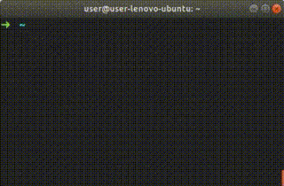
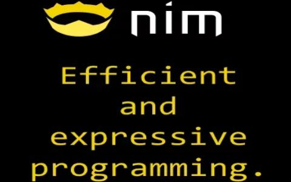
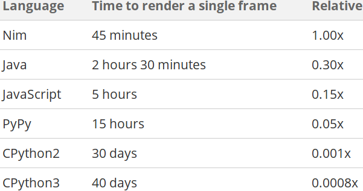
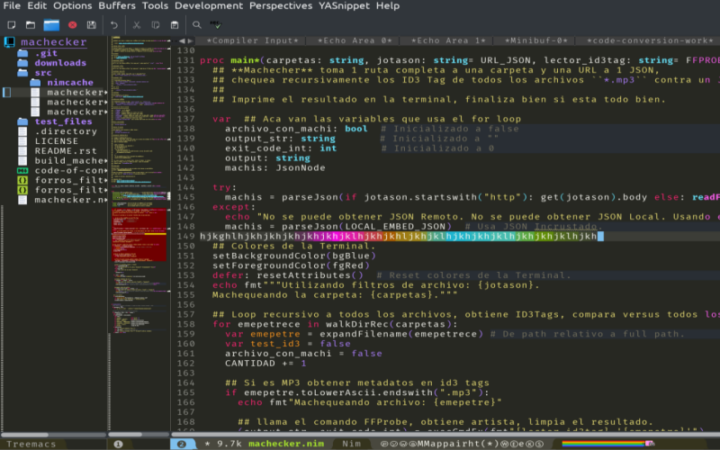

# Intro a Nim


*...para Pythoneras*

-----


* Python Syntax y rendimiento de C.
* Compilado (Binario ejecutable).
* Tipado estatico fuerte con Inferencia.
* Compila a C / C++.
* Compila a JavaScript (DOM API).
* Linux, Windows, Mac, Web, etc.
* Facil hacer modulos de Python.
* Facil usar librerias en C.

-----

### Hola Mundo!

```bash
$ mkdir /tmp/prueba ; cd /tmp/prueba/

$ echo 'echo "Hola Mundo"' > hello.nim

$ nim c -r hello.nim          # C
Hola Mundo

$ nim cpp -r hello.nim        # C++
Hola Mundo

$ nim c --cpu:amd64 --os:windows hello.nim
$ wine hello.exe              # Windows
Hola Mundo

$ nim js -d:nodejs hello.nim  # NodeJS
$ nodejs hello.js
Hola Mundo

$ nim js hello.nim            # Web (Frontend)

$ lsb_release -d
Description:  Arch Linux
```

[<sub>Codigo de todos los slides esta en el Repo</sub>](etc/hello.nim)

-----

### Interprete Interactivo



- `nimble install inim`

-----

### Enchufar C

```bash
$ mkdir /tmp/prueba ; cd /tmp/prueba/

$ echo 'int suma2Enteros(int a, int b) {return a + b;}' > suma.c

$ cat ejemplo.nim
{.compile: "suma.c".}
proc suma2Enteros(a, b: cint): cint {.importc.}
echo suma2Enteros(1, 2)

$ nim c -r ejemplo.nim
3

```

[<sub>Codigo en Repo</sub>](etc/ejemplo.nim)

-----

##### Enchufar Web

<sub>JavaScript &dzigrarr; Nim</sub>

```bash
$ cat index.html
<script>function suma2Enteros(a, b) {return alert(a + b)}</script>
<script src="ejemplojs2nim.js"></script>

$ cat ejemplojs2nim.nim
proc suma2Enteros(a, b: cint): cint {.importc.}
echo suma2Enteros(1, 2)

$ nim js -o:ejemplojs2nim.js ejemplojs2nim.nim

$ xdg-open index.html
```

<sub>Nim &dzigrarr; JavaScript</sub>

```bash
$ cat index2.html
<script src="ejemplonim2js.js"></script>
<script>alert(suma2Enteros(1, 2))</script>

$ cat ejemplonim2js.nim
proc suma2Enteros(a, b: cint): cint {.exportc.} = a + b

$ nim js -o:ejemplonim2js.js ejemplonim2js.nim

$ xdg-open index2.html
```

[<sub>Codigo en Repo</sub>](etc/)

-----

##### Syntaxis

- Bloques de codigo por Indentacion, no Tabs, no Brackets, no Semicolon.
- Comentarios empiezan con `#`, DocStrings con `##`.
- Tracebacks a color simil Python con linea y tipado del error.
- Magias syntax sugar, tipo Python Jupiter Notebook.
- Templates, reemplazan su invocacion con su contenido en compilacion.
- Macros, bloques que agregan funcionalidad en tiempo de ejecucion.
- Overload en funciones, dependiendo el tipo de argumento.
- Exportar objetos con `*`, `cosa` es privado, `cosa*` es exportado.
- `import modulo` importa todo lo que tenga `*` en `modulo.nim`.
- [Algunos modulos de Python fueron clonados en Nim.](https://nimble.directory/search?query=python)

-----

##### Herramientas

- Linters `nim check`, `nimble check` y `nim pretty`.
- Generador de Documentacion integrado `nim doc`.
- Paquetes y docs hosteados https://nimble.directory
- Nim esta escrito en Nim, facil de hackear.
- Template de nuevo projecto `nimble init`.
- Task Runner `nimble tasks` *(tipo Grunt/Gulp)*.
- Publicar paquete `nimble publish` *(PR en GitHub)*.
- NimSuggest autogenerador de autocompletado para IDE.
- NimInst autogenerador de instaladores (InnoSetup, Bash).
- NimGrep Grep optimizado para Nim (CamelCase vs snake_case).
- Garbage Collector GC personalizable o desactivado.

-----

##### PyLib

- Copia *(aun mas)* la syntaxis de Python en Nim.
- `nimble install pylib`, luego `import pylib`.

```python
>>> import pylib
>>> for i in range(10):   # Mimic Pythons range()
      print(i, endl=" ")  # Mimic Pythons print()
0 1 2 3 4 5 6 7 8 9
>>> print(json_loads("""{"clave": "valor"}""")  #  Mimic Pythons json.loads(str)
{"clave": "valor"}
>>> print(sys.platform)              #  Mimic Pythons sys.*
"linux"
>>> print(platform.processor)        #  Mimic Pythons platform.*
"amd64"
>>> print(int('9'))    # integer from char.
>>> print("" or "b")   #  Mimic Pythons str or str
"b"
>>> print("a" or "b")
"a"
>>> timeit(100):  # Mimic Pythons timeit.timeit("code_to_benchmark", number=int)
      sleep(9)    # Repeats this code 100 times. Output is very informative.
2018-05-09T02:01:33 TimeIt: 100 Repetitions on 920 milliseconds, and 9 microseconds, CPU Time 0.00128.
>>> with_open("archivo.txt", 'r'):  # Mimics Pythons with open(file, mode='r') as file:
      while not end_of_file(file):  # File is automatically assigned to file variable.
        print(file.read_line())     # No need for " as file", just path and mode.
                                    # File is closed automatically.
```

-----

##### Inmutable en Nim

- `var` Mutable, como en Python.
- `let` Inmutable, solo lectura.
- `const` Inmutable, tiempo de Compilacion.

```nim
>>> var foo = "Esta variable puede cambiar"
>>> foo = "Otra cosa"
>>>
>>> let bar = "Esta variable No se puede cambiar"
>>> bar = "Da Error"
Error: 'bar' cannot be assigned to
>>>
>>> const baz = "Constante de Compilacion"
>>> baz = "Da Error"
Error: 'baz' cannot be assigned to
```

*Si se te complica, podes usar `var` en todos lados.*

-----

##### Ejecutar en Tiempo de Compilacion

- `const constante = "compile time"` Constante de compilacion.
- `include("incluir.nim")` Copia el archivo entero en el lugar.
- `static_read("foo.json")` Lee archivo entero y devuelve string.
- `static_exec("1 + 1")` Ejecuta argumentos y devuelve el retorno.
- `static: echo("compile time")` Ejecuta Bloques de codigo.

*Lo que se ejecuta en tiempo de compilacion no tiene costo en tiempo de ejecucion.*

-----

##### Tipos Basicos

Nim         | Python  | Ejemplo Nim   | Ejemplo Python  | Comentarios                               |
------------|:--------|:-------------:|:---------------:|------------------------------------------:|
 `string`   | `str`   | `"foo"`       | `"foo"`         | Unicode, UTF8, Emoji, etc                 |
 `string`   | `str`   | `"""bar"""`   | `"""bar"""`     | String Multi-linea                        |
 `char`     | -       | `'a'`         | -               | 1 char, Optimizado internamente a int     |
 `int`      | `int`   | `42`          | `42`            | int8, int16, int32, int64, int            |
 `float`    | `float` | `2.0`         | `2.0`           | float32, float64, float                   |
 `bool`     | `bool`  | `true, false` | `True, False`   | true, false en Nim                        |
 `tuple`    | `tuple` | `(1, 2, 3)`   | `(1, 2, 3)`     | tuple de Nim es como NamedTuple de Py     |
 `seq`      | `list`  | `@[1, 2, 3]`  | `[1, 2, 3]`     | Mismo Tipo en todos los items en Nim      |
 `set`      | `set`   | `{1, 2, 3}`   | `{1, 2, 3}`     | int, char, bool en Nim                    |
 `enum`     | `enum`  | ?             | ?               | En Python no los usa nadie                |
 `array`    | -       | `[1, 2, 3]`   | -               | Tamanio fijo, mismo tipo en los items     |
 `subrange` | -       | `range[0..2]` | -               | Solo acepta int de 0 a 2,puede usar float |

*Tipos de Nim estan optimizados para performance.*

-----

##### Detalles

- Python `def` es Nim `proc`.
- Python `lambda` es Nim `proc` (sin nombre).
- Python `f"{foo},{1+1}"` es Nim `fmt"{foo},{1+1}"`.
- Python `dict` es Nim `table` o `OrderedTable`.
- Python `NamedTuple` es Nim `tuple`.
- Python `set` es Nim `HashSet` o `OrderedSet`.
- Python Operador Ternario es Nim `if..else` inline.
- Python Comprension de Lista en modulo `sugar`.
- Nim string es `""`, no `''` (es `char`).
- Go `defer` es Nim `defer`.
- Go `channels` es Nim `channels`.
- JavaScript Arrows Functions en modulo `sugar`.

-----

##### Nim Unified Functions Call Syntax

- Todas las formas son validas y equivalentes.

```nim
>>> let foo = [1, 2, 3]

>>> foo.len
3

>>> foo.len()
3

>>> len(foo)
3

>>> $foo.len      # Magia convierte a string.
"3"

>>> foo.len.int8  # Dot chain.
3 : int8
```

-----

##### Nim Case Insensitive



- camelCase y snake_case podes usarlo como te guste.
- Todas las formas son validas y equivalentes.

```nim
>>> let camelCase = 42  # Es lo mismo que camel_case.
>>> camel_case
42

>>> let snake_case = 1  # Es lo mismo que snakeCase.
>>> snakeCase
1
```

-----

##### Velocidad

- Nim fue pensado para ir muy rapido.
- Benchmarks: Falta Nim o esta a la par con C.

Ejemplo, mismo RayTracer implementado en varios lenguajes:



-----

##### Peso

```bash
$ echo 'echo "Hola Mundo"' > hello.nim
$ nim c -d:release --app:console --opt:size hello.nim
$ strip --strip-all hello
$ upx --best --ultra-brute hello
$ du -h hello
15K     hello
```

- Nim fue pensado para ser liviano (Raspi, Router, IoT, etc).
- Nim no incrusta Runtime, VM, Interprete, etc.
- [HolaMundo Go 2Mb, HolaMundo Nim 20Kb.](http://linkode.org/#narWOQnU9i2UDswu9NDYo1)


-----

##### NimScript

- Lenguaje interpretado *(Nim limitado, no std lib)*.
- Modulos disponibles: strutils, ospaths, math, distros.
- Puede usarse como configuracion avanzada.
- Puede usarse como build (build tool).
- Puede usarse con Nimble.
- Puede usarse como multi-proposito (standalone).
- Extension de archivo `*.nims`.
- No se compila, usa `nim e archivo.nims`.

**Hola Mundo NimScript:**

```nim
#!/usr/bin/env nim
echo "Hola mundo"
```

-----

##### Unittests

- Tests Runner amigable.
- `nim c -r test "Nombre del test"`.

```nim
suite "Nombre del test":

  echo "Setup: Esto se ejecuta 1 vez ANTES de TODOS los Tests."

  setup:
    echo "Setup: Esto se ejecuta 1 vez ANTES de CADA Test."

  teardown:
    echo "Teardown: Esto se ejecuta 1 vez DESPUES de CADA Test."

  test "ejemplo":
    assert true

  test "otro ejemplo":
    check(1 != 1)

  test "ejemplo con error esperado":
    let foo = [1, 2, 3]
    expect(IndexError):
      echo foo[9]

  echo "Teardown: Esto se ejecuta 1 vez DESPUES de TODOS los Tests."

```

-----

##### Generador de Documentacion

*Formato entrada:*
- Codigo fuente texto plano Nim `*.nim`

*Formato salida:*
- HTML5 (TOC, Search, links, index, etc).
- reStructuredText.
- JSON.
- LaTeX.

*Uso:*
- Comentarios con `##` parsea a RST o texto.

-----

##### CrossCompilar

Basicamente hay que pasarle la ruta donde esta el Compilador.

```bash
$ mkdir /tmp/prueba_nim_crosscompile ; cd /tmp/prueba_nim_crosscompile/

$ echo 'echo "Hola Mundo"' > hello.nim

$ nim c --cpu:amd64 --os:windows --gcc.exe:x86_64-w64-mingw32-gcc \
        --gcc.linkerexe:x86_64-w64-mingw32-gcc hello.nim

$ wine hello.exe
Hola Mundo
```

Las libs de crosscompile se instalan instalando `mingw-w64-gcc` (Arch).

http://linkode.org/#1FCAxFC9JPKRc12pyupxu6

*Dependera un poco que tan amigable es tu Distro con las Libs de crosscompile.*

-----

##### Template Engine

- Template Engine integrado (ala Jinja).
- Archivos `*.tmpl`, shebang y syntaxis Nim.
- Lineas con `#` es codigo Nim, sino literal verbatim.

```nim
#? stdtmpl | standard
#proc generateHTMLPage(title, currentTab, content: string,
#                      tabs: openArray[string]): string =
#  result = ""
<head><title>$title</title></head>
<body>
  <div id="menu">
    <ul>
  #for tab in items(tabs):
    #if currentTab == tab:
    <li><a id="selected"
    #else:
    <li><a
    #end if
    href="${tab}.html">$tab</a></li>
  #end for
    </ul>
  </div>
  <div id="content">
    $content
    A dollar: $$.
  </div>
</body>
```

-----

##### Nim Frontend

- Nim compila a JavaScript.
- Nim tiene API del DOM.
- JavaScript es "First Class Citizen".
- Nim wrappea Libs JS facilmente.
- Nim Frontend va muy rapido tambien.
- Hay paquetes con Libs Frontend en Nimble.
- Podes compilar Nim a JavaScript y usarlo en HTML Estatico.

Ejemplos:
- Frontend SPA (React-like) https://github.com/pragmagic/karax
- Foro Nim esta hecho en Nim https://forum.nim-lang.org

-----

*Paquetes interesantes Terminal:*
- Colores https://github.com/molnarmark/colorize
- Spinners https://github.com/molnarmark/spinny
- ProgressBar https://github.com/euantorano/progress.nim
- Graficos https://github.com/FedericoCeratto/nim-dashing
- Configs https://github.com/euantorano/dotenv.nim

*Paquetes interesantes Web:*
- Web Creator https://github.com/ThomasTJdev/nim_websitecreator
- Web Framework https://github.com/dom96/jester
- Markdown a HTML https://github.com/h3rald/hastyscribe
- Scrapper https://github.com/OpenSystemsLab/q.nim
- Jupyter Kernel https://github.com/stisa/jupyter-nim-kernel
- Plotly https://github.com/brentp/nim-plotly
- Poors Woman Design https://github.com/juancarlospaco/nim-random-font-color

-----

##### Extras recomendados

- Homepage https://nim-lang.org
- Probar Nim desde el Browser https://play.nim-lang.org
- DevDocs http://devdocs.io/nim
- StackOverflow https://stackoverflow.com/questions/tagged/nim
- Rosetta http://rosettacode.org/wiki/Category:Nim
- Tutorial https://nim-lang.org/docs/tut1.html
- Syntax Python https://github.com/Yardanico/nimpylib
- GUI super facil https://github.com/juancarlospaco/nim-kdialog
- Awesome Nim https://github.com/VPashkov/awesome-nim
- Comunidad Online Nim AR https://t.me/NimArgentina
- Comunidad Online Nim EN https://t.me/nim_lang

-----

##### Instalar

- [ChooseNim](https://github.com/dom96/choosenim#choosenim)
- Windows, es [1 ZIP.](https://nim-lang.org/install_windows.html)
- [Docker](https://hub.docker.com/r/nimlang/nim/), imagen `nimlang/nim`.
- Os X, igual a Linux.
- Linux, paquete de Distro o ChooseNim.
- Manual, codigo fuente en cualquier OS.

*Solo requiere un Compilador de C.*

-----

##### Editor / IDE soporte para Nim



Vim, Emacs, Atom, Kate, Aporia, VS Code, etc etc.

- https://github.com/nim-lang/Nim/wiki/editor-support

-----

### Nim necesita mas Comunidad


- https://t.me/NimArgentina

*Sumate!, Que empieze el hype !*

-----

##### Thanks! &hearts;


<sub>Juan Carlos</sub> [<sub>github.com/juancarlospaco</sub>](https://github.com/juancarlospaco) [<sub>twitter.com/juancarlospaco</sub>](https://twitter.com/juancarlospaco)

[<sub>Repo de esta Presentacion en GitHub.</sub>](https://github.com/juancarlospaco/nim-presentation-slides#nim-presentation-slides)

[<sub><i>Presentacion hecha en Markdown con Microraptor.</i></sub>](https://github.com/juancarlospaco/microraptor#microraptor)
