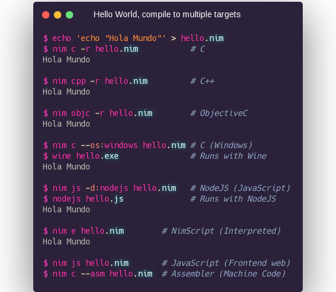
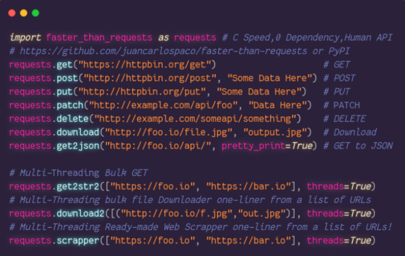
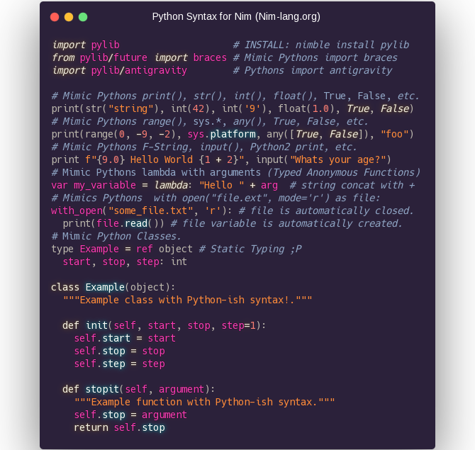
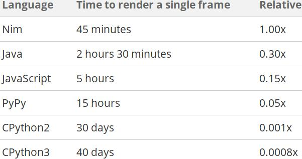

# Intro a Nim


*...para Pythoneras*

-----


* Python Syntax y rendimiento de C.
* Compilado (1 archivo binario ejecutable).
* Tipado estatico fuerte con Inferencia.
* Compila C/C++/ObjC/JavaScript/NodeJS (DOM API).
* Linux, Windows, Mac, Web, Raspi, ARM, IoT, etc.
* Facil hacer modulos Python. Facil usar librerias C.
* Administrador de Paquetes, 1500+ Paquetes.
* Documentacion online completa con ejemplos.
* Targets comunidad LLVM,Vulkan,WebGL,OpenGL,etc.

-----

##### echo "Hola Mundo"



[<sub>Codigo de todos los slides esta en el Repo</sub>](ejemplos/hello.nim)

-----

#### Para que sirve?

* Todo tu Stack con 1 lenguaje, Backend & Frontend.
* Frontend funciona similar a Svelte.
* Python funciona similar a Cython.
* Backend funciona similar a Rust.
* Interoperabilidad con C/JS. Deploy simple (`scp`).
* Usualmente lleva menos lineas de codigo que Python.
* Mas rapido de aprender comparado con Rust o C++.
* Binarios mas chicos que Rust y Go. Compilacion rapida.
* Programacion Inmutable, Funcional y OOP al mismo tiempo.
* AutoDocumentador y AutoFormateador de Codigo integrados.
* Databases (Postgres y SQLite en std lib, Compile-Time ORM).
* Machine Learning, AI, HPC (PyTorch, Arraymancer, Laser).
* FullStack web frameworks (NimWC, Karax, Jester, HTTPBeast).
* Desktop GUI (GTK3, Qt5 QML, OpenGL, WebView JS, Terminal).
* Translation (Nimterlingua traduce codigo sin modificarlo).
* Design (compila Figma a App con Fidget).

-----

##### Python usando Nim



- Libreria cliente HTTPS con web scraper multi-threading.

-----

##### Sintaxis Python para Nim



<sub>https://github.com/Yardanico/nimpylib</sub>

-----

##### Sintaxis Nim

- Bloques de codigo por Indentacion, no Tabs, no Brackets, no Semicolon.
- Comentarios son Documentacion (RST/Markdown) empiezan con `##`.
- Tracebacks a color simil Python con linea, posicion y tipo de error.
- Templates, reemplazan su invocacion con su contenido en compilacion.
- Macros, bloques que agregan funcionalidad en tiempo de ejecucion.
- Overload en funciones, dependiendo el tipo de argumento.
- Exportar objetos con `*`, `cosa` es privado, `cosa*` es publico.
- `import modulo` importa todo lo que tenga `*` en `modulo.nim`.
- [Algunos modulos de Python fueron clonados en Nim.](https://nimble.directory/search?query=python)
- Nim esta escrito en Nim, facil de hackear.

-----

##### Herramientas

- Linters `nim check`, `nimble check`.
- Documentacion `nim doc`, `nim rst2html`, `nim rst2tex`
- Template de nuevo projecto `nimble init`.
- Task Runner `nimble tasks` *(tipo Grunt/Gulp)*.
- Paquetes y docs hosteados https://nimble.directory
- Publicar paquete `nimble publish` *(PR en GitHub)*.
- NimInst autogenerador de instaladores (InnoSetup, Bash).
- NimScript para reemplazar Bash.
- `nimpretty` formateador de codigo (ala GoFmt, AutoPep8)
- `c2nim` para portar codigo C a Nim.
- Toda herramienta de C/C++ sirve (gdb, etc).

-----

##### Generador de Documentacion

*Formato entrada:*
- Codigo fuente Nim `*.nim`
- ReStructuredText/Markdown.

*Formato salida:*
- HTML5 (TOC, Search, links, index, etc).
- LaTeX.
- ODT (LibreOffice).
- JSON.

*Uso:*
- Comentarios con `##` ReStructuredText/Markdown.
- No hay que instalar nada extra para usarlo.

-----

### Interprete Interactivo


- `nimble install inim` o `nim secret`.

-----

##### Inmutable

- `var` Mutable, como en Python.
- `let` Inmutable, solo lectura.
- `const` Inmutable, tiempo de Compilacion.

```nim
>>> var foo = "Esta variable puede cambiar"
>>> foo = "Otra cosa"
>>>
>>> let bar = "Esta variable No se puede cambiar"
>>> bar = "Da Error"
Error: 'bar' cannot be assigned to
>>>
>>> const baz = "Constante de Compilacion"
>>> baz = "Da Error"
Error: 'baz' cannot be assigned to
```

*Si se te complica, podes usar `var` en todos lados.*

-----

##### Ejecutar en Tiempo de Compilacion

- `const constante = "compile time"` Constante de compilacion.
- `include("incluir.nim")` Copia el archivo entero en el lugar.
- `staticRead("foo.json")` Lee archivo entero y devuelve string.
- `staticExec("1 + 1")` Ejecuta argumentos y devuelve el retorno.
- `static: echo("compile time")` Ejecuta Bloques de codigo.
- FFI, Regex, JSON, en tiempo de compilacion.

*Lo que se ejecuta en tiempo de compilacion no tiene costo en tiempo de ejecucion.*

-----

##### De Python a Nim

- `def` ➡️ `proc`
- `lambda` ➡️ `proc`
- `f"{foo},{1+1}"` ➡️ `fmt"{foo},{1+1}"`
- `dict` ➡️ `table`
- `NamedTuple` ➡️ `tuple`
- `set` ➡️ `HashSet`
- `b if a else c` ➡️ `if a: b else: c` inline
- Go `defer` ➡️ Nim `defer`.
- Go `channels` ➡️ Nim `channels`.
- JavaScript Arrows Functions en modulo `sugar`.

-----

##### Nim Unified Functions Call Syntax

- Todas las formas son validas y equivalentes.

```nim
>>> let foo = [1, 2, 3]

>>> foo.len()
3

>>> len(foo)
3

>>> foo.len.float  # Dot chain.
3.0
```

-----

##### Tipos Basicos

Nim         | Python  | Ejemplo Nim    | Ejemplo Python  | Comentarios                               |
------------|:--------|:--------------:|:---------------:|------------------------------------------:|
 `string`   | `str`   | `"foo"`        | `"foo"`         | Unicode, UTF8, Emoji, etc                 |
 `string`   | `str`   | `"""bar"""`    | `"""bar"""`     | String Multi-linea                        |
 `char`     | -       | `'a'`          | -               | 1 char, Optimizado internamente a int     |
 `int`      | `int`   | `42`           | `42`            | int8, int16, int32, int64, int            |
 `float`    | `float` | `2.0`          | `2.0`           | float32, float64, float                   |
 `bool`     | `bool`  | `true, false`  | `True, False`   | true, false en Nim                        |
 `tuple`    | `tuple` | `(1, 2, 3)`    | `(1, 2, 3)`     | tuple de Nim es como NamedTuple de Py     |
 `seq`      | `list`  | `@[1, 2, 3]`   | `[1, 2, 3]`     | Mismo Tipo en todos los items en Nim      |
 `set`      | `set`   | `{1, 2, 3}`    | `{1, 2, 3}`     | int, char, bool en Nim                    |
 `enum`     | `enum`  | `type enum`    | ?               | En Python no los usa nadie                |
 `array`    | -       | `[1, 2, 3]`    | -               | Tamanio fijo, mismo tipo en los items     |
 `subrange` | -       | `range[0..2]`  | -               | Solo acepta int de 0 a 2,puede usar float |
 `concept`  | -       | `type concept` | -               | Tipos definidos por usuario,compile time  |

*Tipos de Nim estan optimizados para performance.*

-----

##### Velocidad

- Cualquier performance alcanzable con C es alcanzable con Nim.
- Puede usar Assembler inlined directamente.
- Usa poca RAM y funciona rapido en PC viejas.
- No necesita "preparar un ambiente" en la PC.

Ejemplo, mismo RayTracer implementado en varios lenguajes:



[<sub>Source</sub>](http://blog.johnnovak.net/2017/04/22/nim-performance-tuning-for-the-uninitiated/#does-it-all-matter)

-----

##### Peso

- Nim fue pensado para ser liviano (Raspi, Router, IoT, etc).
- Nim no incrusta Runtime, VM, Interprete, etc.
- [HolaMundo Go 2Mb, HolaMundo Nim 20Kb.](http://linkode.org/#narWOQnU9i2UDswu9NDYo1)

```bash
$ echo 'echo "Hola Mundo"' > hello.nim
$ nim c -d:release --app:console --opt:size hello.nim
$ strip --strip-all hello
$ du -h hello
15K     hello
```


-----

##### NimScript

- Scripting MultiPlataforma, Nim en modo interpretado.
- Muchos modulos libreria standard disponibles.
- Configuracion, build (build tool).
- Puede usarse con Nimble.
- Puede usarse como multi-proposito (standalone).
- Extension de archivo `*.nims`.
- No se compila, usa `nim e archivo.nims`.
- Administrador de paquetes, test, docs, asserts.

**Hola Mundo NimScript:**

```nim
echo "Hola mundo"
```

-----

### Conectar con C

C:

```c
int suma2Enteros(int a, int b) {return a + b;}
```

Nim:

```nim
{.compile: "suma.c".}
proc suma2Enteros(a, b: cint): cint {.importc.}
echo suma2Enteros(1, 2)
```

```bash
$ nim c -r ejemplo.nim
3
```

[<sub>Codigo en Repo</sub>](ejemplos/ejemplo.nim)

-----

##### Conectectar con la Web

<sub>JavaScript &dzigrarr; Nim</sub>

```html
<!-- index.html --->
<script>function suma2Enteros(a, b) {return alert(a + b)}</script>
<script src="ejemplojs2nim.js"></script>
```

```nim
# ejemplojs2nim.nim
proc suma2Enteros(a, b: cint): cint {.importc.}
echo suma2Enteros(1, 2)
```

```bash
$ nim js -o:ejemplojs2nim.js ejemplojs2nim.nim
$ xdg-open index.html  # Abre el Navegador Web.
```

<sub>Nim &dzigrarr; JavaScript</sub>

```html
<!-- index2.html --->
<script src="ejemplonim2js.js"></script>
<script>alert(suma2Enteros(1, 2))</script>
```

```nim
# ejemplonim2js.nim
proc suma2Enteros(a, b: cint): cint {.exportc.} = a + b
```

```bash
$ nim js -o:ejemplonim2js.js ejemplonim2js.nim
$ xdg-open index2.html  # Abre el Navegador Web.
```

-----

##### Conectar con Python

Nim:

```nim
import nimpy
proc funcioncita*(nombre: string): string {.exportpy.} = "Hola " & nombre
```

Python (2 o 3):

```nim
import nim2python
print(nim2python.funcioncita("Mundo"))
```

Instalar puente Python-Nim:

- `nimble install nimpy`.

Compilar:

`nim c --app:lib --out:modulo.so codigo.nim`

<sub>Nim compila luego no requiere Nim para funcionar. Se puede subir a PyPI</sub>

-----

##### Unittests

- Tests Runner amigable, `nim c -r test.nim`.

```nim
suite "Nombre del test":

  echo "Setup: Esto se ejecuta 1 vez ANTES de TODOS los Tests."

  setup:
    echo "Setup: Esto se ejecuta 1 vez ANTES de CADA Test."

  teardown:
    echo "Teardown: Esto se ejecuta 1 vez DESPUES de CADA Test."

  test "ejemplo":
    assert true

  test "otro ejemplo":
    check(1 != 1)

  test "ejemplo con error esperado":
    let foo = [1, 2, 3]
    expect(IndexError):
      echo foo[9]

  echo "Teardown: Esto se ejecuta 1 vez DESPUES de TODOS los Tests."

```

-----

##### Templates

<sub>Template reemplazan su invocacion con su contenido en tiempo de compilacion.</sub>

```nim
template templatecita(argumento0, argumento1: string, contenido: untyped): untyped =

  echo 1 + 2       # Simula algo de logica "pre-cocida" dentro del template.

  echo argumento0  # Se puede trabajar con todos los argumentos que recibe.
  echo argumento1

  # Las variables y nombres dentro de un template son solo locales por defecto.
  var variable_injectada {.inject.} = "Gatitos" # No es solo local.
  var variable_solo_local = "Perritos"          # Si es solo local.

  contenido  # Se puede evaluar los contenidos que recibe.


templatecita("primer argumento", "segundo argumento"):

  echo variable_injectada
  # Error: undeclared identifier: 'variable_solo_local'.
  # No esta Injectada con {.inject.}, no existe fuera del template.
  # echo variable_solo_local

  echo "Este es el contenido, el cuerpo del template."
```

*Codigo que hackea codigo a nivel de codigo en compilacion !*

-----

##### Macros

<sub>Macros son como Templates pero en tiempo de ejecucion y hackean el AST al vuelo.</sub>

```nim
import macros

macro generate_hello(): typed =
  parseStmt("""proc hello() = echo "hi" """)

generate_hello()  # Generate a proc via Macros.
hello()

expandMacros:      # Debug
  generate_hello() # Generar y ver el codigo generado por el Macro.
```

*Codigo que hackea codigo a nivel de AST en ejecucion !*

-----

##### Template Engine

- Template Engine integrado (ala Jinja, Jekyll, etc).
- Archivos `*.nimf`, shebang y syntaxis Nim.
- Lineas con `#` es codigo Nim, sino literal verbatim.

```nim
#? stdtmpl | standard
#proc generateXML(name, age: string): string =
<xml>
  <name>$name</name>
  <age>$age</age>
</xml>
```

```nim
#? stdtmpl | standard
#proc generateHTML(title, content: string, tabs: openArray[string]): string =
<head><title> $title </title></head>
<body>
    <ul>
  #for tab in items(tabs):
    <li><a href="${tab}.html">$tab</a></li>
  #end for
    </ul>
    $content
    A dollar: $$.
</body>
```

<sub>No confundir Template-Engine con Templates.</sub>

-----

##### Garbage Collectors

- `RefC`: Cuenta referencias, Default, deferred.
- `markAndSweep`: El mas Rapido, usa mas RAM.
- `Boehm`: El mas lento, usa menos RAM.
- `Go`: Clon de Go Lang.
- `Regions`: Stack regions, casi sin GC.
- `none`: Sin GC.
- `--newruntime`: Experimental, estilo Rust (no BorrowChecker).

-----

# Ejemplos

#### Levenshtein Distance

```nim
echo editDistance("Gato", "Pato")
```

#### Diff

```nim
# 2 txt ("The Call of Cthulhu", Lovecraft)
let txt0 = """I have looked upon all the universe has to hold of horror,
even skies of spring and flowers of summer must ever be poison to me."""
let txt1 = """I have looked upon all your code has to hold of bugs,
even skies of spring and flowers of summer must ever be poison to me."""

echo diffText(txt0, txt1)
```

#### Syntax Highliting

```nim
let code = """for x in $int.high: echo x.ord mod 2 == 0"""
var toknizr: GeneralTokenizer
initGeneralTokenizer(toknizr, code)
while toknizr.kind != gtEof:
  getNextToken(toknizr, langNim)
  echo toknizr.kind
```

- Todo esto es Libreria Standard.

-----

##### Nim Frontend

- Nim compila a JavaScript.
- Nim tiene API del DOM.
- JavaScript es "First Class Citizen".
- Nim wrappea Libs JS facilmente.
- Nim Frontend va muy rapido tambien.
- Hay paquetes con Libs Frontend en Nimble.
- Podes compilar Nim a JavaScript y usarlo en HTML Estatico.
- Se puede compilar a WebAssembly.

Ejemplos:
- Frontend SPA (React-like) https://github.com/pragmagic/karax
- Foro Nim esta hecho en Nim https://forum.nim-lang.org

-----

*Paquetes interesantes Terminal:*
- Colores https://github.com/molnarmark/colorize
- Spinners https://github.com/molnarmark/spinny
- ProgressBar https://github.com/euantorano/progress.nim
- Graficos https://github.com/FedericoCeratto/nim-dashing
- Configs https://github.com/euantorano/dotenv.nim

*Paquetes interesantes Web:*
- Web Creator https://github.com/ThomasTJdev/nim_websitecreator
- Web Framework https://github.com/dom96/jester
- Markdown a HTML https://github.com/h3rald/hastyscribe
- Scrapper https://github.com/OpenSystemsLab/q.nim
- Jupyter Kernel https://github.com/stisa/jupyter-nim-kernel
- Plotly https://github.com/brentp/nim-plotly
- Poors Woman Design https://github.com/juancarlospaco/nim-random-font-color

-----

##### Extras recomendados

- Homepage https://nim-lang.org
- Probar Nim desde el Browser https://play.nim-lang.org
- DevDocs http://devdocs.io/nim
- StackOverflow https://stackoverflow.com/questions/tagged/nim
- Rosetta http://rosettacode.org/wiki/Category:Nim
- Tutorial https://nim-lang.org/docs/tut1.html
- Syntax Python https://github.com/Yardanico/nimpylib
- GUI super facil https://github.com/juancarlospaco/nim-kdialog
- Awesome Nim https://github.com/VPashkov/awesome-nim
- Comunidad Online Nim AR https://t.me/NimArgentina
- Comunidad Online Nim EN https://t.me/nim_lang

-----

##### Instalar

**Linux & Mac**
- [ChooseNim](https://github.com/dom96/choosenim#choosenim)

```
curl https://nim-lang.org/choosenim/init.sh -sSf | sh
```

**Windows**
- [1 ZIP.](https://nim-lang.org/install_windows.html)

**Otros**
- [Docker](https://hub.docker.com/r/nimlang/nim/), imagen `nimlang/nim`.
- Manual, codigo fuente en cualquier OS.

*Solo requiere un Compilador de C.*

-----

##### Editor / IDE soporte para Nim


[Vim](https://github.com/zah/nim.vim/),
[Emacs](https://github.com/nim-lang/nim-mode),
[Atom](https://github.com/russpowers/nim-atom),
[Sublime](https://github.com/Varriount/NimLime),
[Kate](https://github.com/juancarlospaco/NimKate#screenshots),
[Gedit](https://github.com/nim-lang/Aporia/blob/master/share/gtksourceview-2.0/language-specs/nim.lang),
[Geany](https://github.com/geany/geany/pull/193),
[KDevelop](https://github.com/xyz32/KDevelop-template),
[VS Code](https://marketplace.visualstudio.com/items?itemName=kosz78.nim),
[Spacemacs](https://github.com/juancarlospaco/spacemacs-nim-python#spacemacs-nim-python),
[NeoVim](https://github.com/baabelfish/nvim-nim),
[Notepad++](https://github.com/jangko/nppnim/releases),
[LightTable](https://github.com/zah/nim.lt/),
[Aporia](https://github.com/nim-lang/Aporia),
[etc etc...](https://github.com/nim-lang/Nim/wiki/editor-support)

-----

### Nim necesita mas Comunidad


- ` https://t.me/NimArgentina `

*Sumate!, Nim tiene cosas aun mas interesantes; Que empieze el hype !*

-----

##### Thanks! &hearts;


*Juan Carlos*

- [<sub>github.com/juancarlospaco</sub>](https://github.com/juancarlospaco) [<sub>twitter.com/juancarlospaco</sub>](https://twitter.com/juancarlospaco) [<sub>t.me/juancarlospaco</sub>](https://t.me/juancarlospaco)
- [<sub>Repo de esta Presentacion en GitHub.</sub>](https://github.com/juancarlospaco/nim-presentation-slides#nim-presentation-slides)
- [<sub><i>Presentacion hecha en Markdown con Microraptor.</i></sub>](https://github.com/juancarlospaco/microraptor#microraptor)
